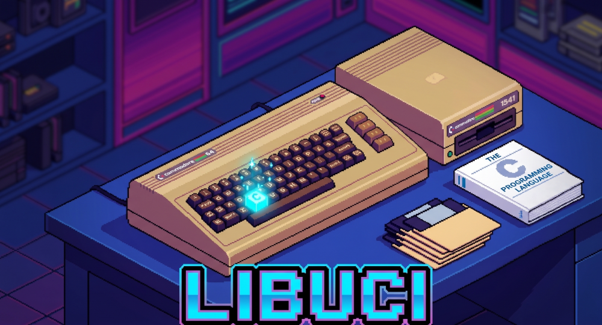

`libuci` is a C library for the Commodore 64 that implements the client side of the [Ultimate Command Interface (UCI)](https://1541u-documentation.readthedocs.io/en/latest/uci/index.html) protocol, supporting `cc65` and `oscar64` compilers.

UCI allows C64 programs to communicate with Ultimate devices programmatically through cartridge port registers.

## Features

- **File Access (DOS):** Read, write, rename, and delete files on SD cards or USB storage, navigate directories, and read the real-time clock.
- **Networking:** Fetch network interface details (IP, MAC) and open TCP or UDP sockets.
- **SoftIEC & DMA Load:** Mount disk images (`.d64`, `.d71`, `.d81`) and load binaries directly into C64 RAM via DMA.
- **System Control:** Query installed SID chips, hardware info, and reboot the system.
- **Text Codec:** Convert strings between ASCII (firmware), PETSCII and Screen Codes (C64 display).

## Usage

To use `libuci` in your project, copy the header file(s) from [`include/`](include) and the source file(s) you need from [`src/`](src) (`core.c` along with specific subsystem modules like `dos.c` or `net.c`) into your project's build setup.

Detailed API documentation and function comments are located in the header files:
- [`include/uci.h`](include/uci.h): API for DOS, network, control, and SoftIEC/DMA functions.
- [`include/uci_codec.h`](include/uci_codec.h): Optional string encoding conversion functions.

## Examples

Sample programs demonstrating each feature can be found in the [`examples/`](examples) directory:

- [`01_sysinfo_dump`](examples/01_sysinfo_dump): Hardware detection, network info, and RTC time.
- [`02_http_client`](examples/02_http_client): TCP socket HTTP GET request.
- [`03_ntp_rtc_sync`](examples/03_ntp_rtc_sync): UDP socket time synchronization.
- [`04_dma_fastload`](examples/04_dma_fastload): DMA loading directly into C64 RAM.
- [`05_d64_mounter`](examples/05_d64_mounter): Disk image mounting and directory listing.
